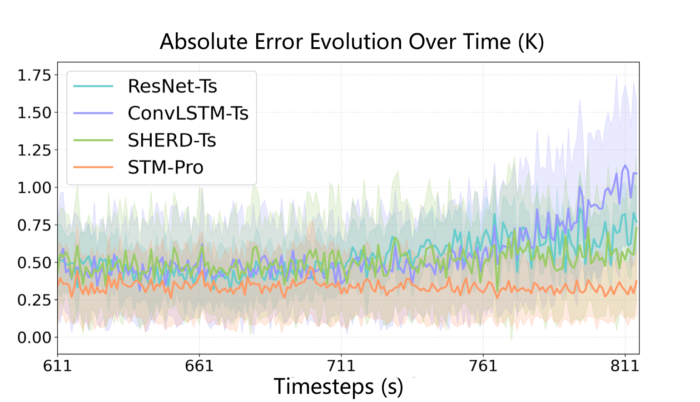
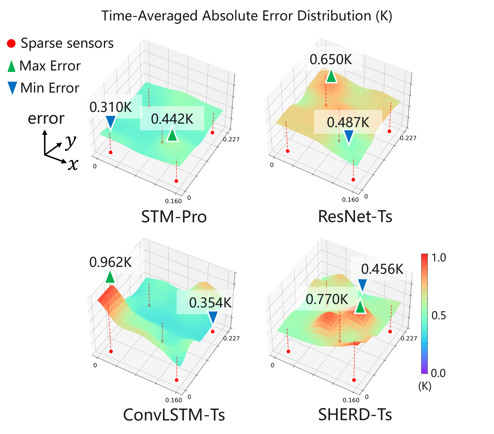
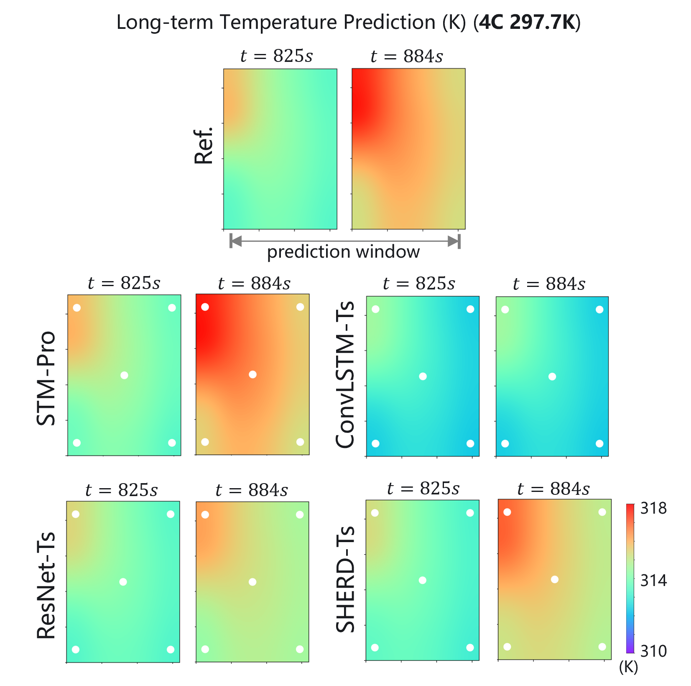
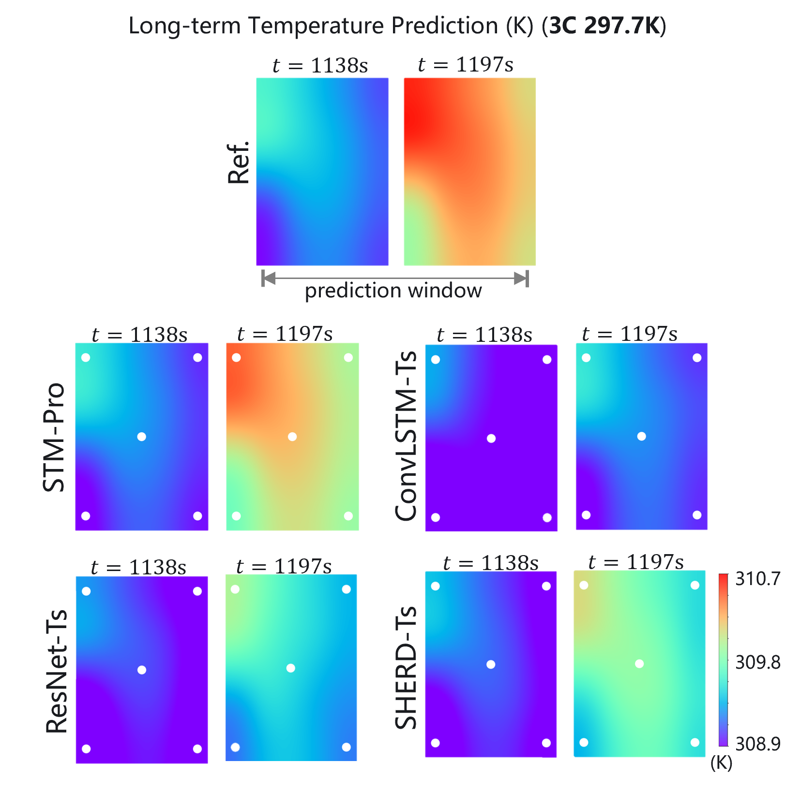
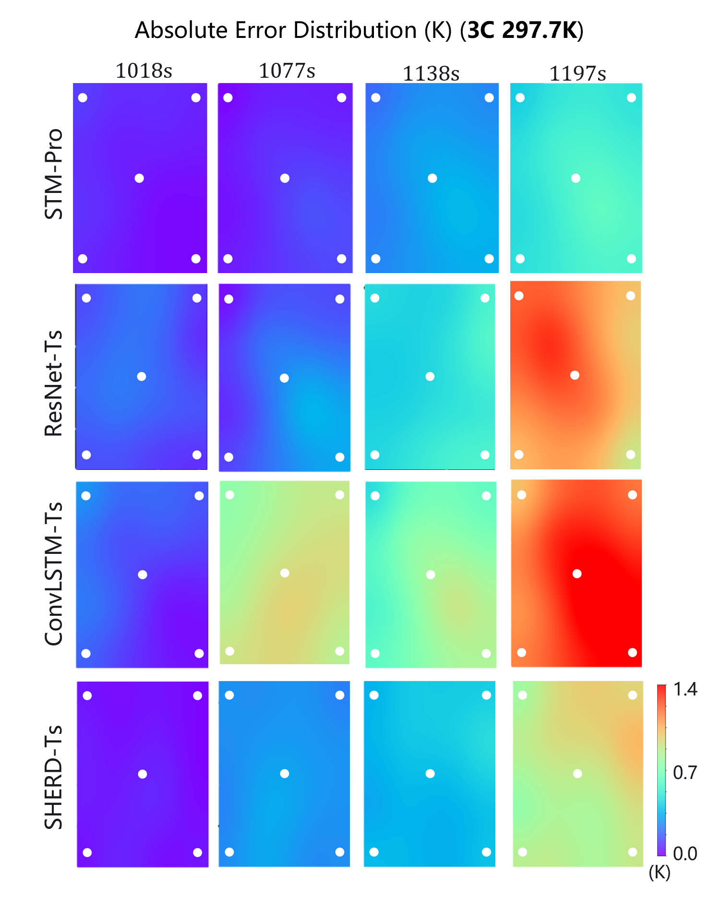
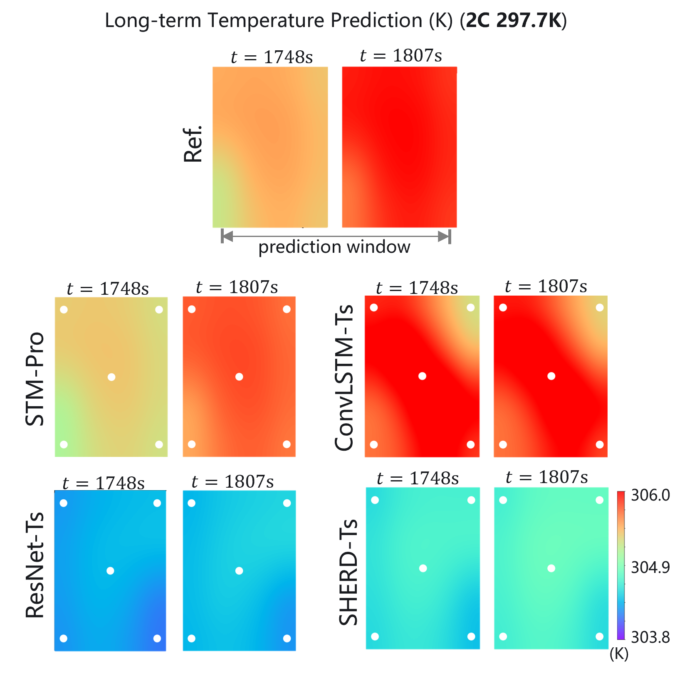
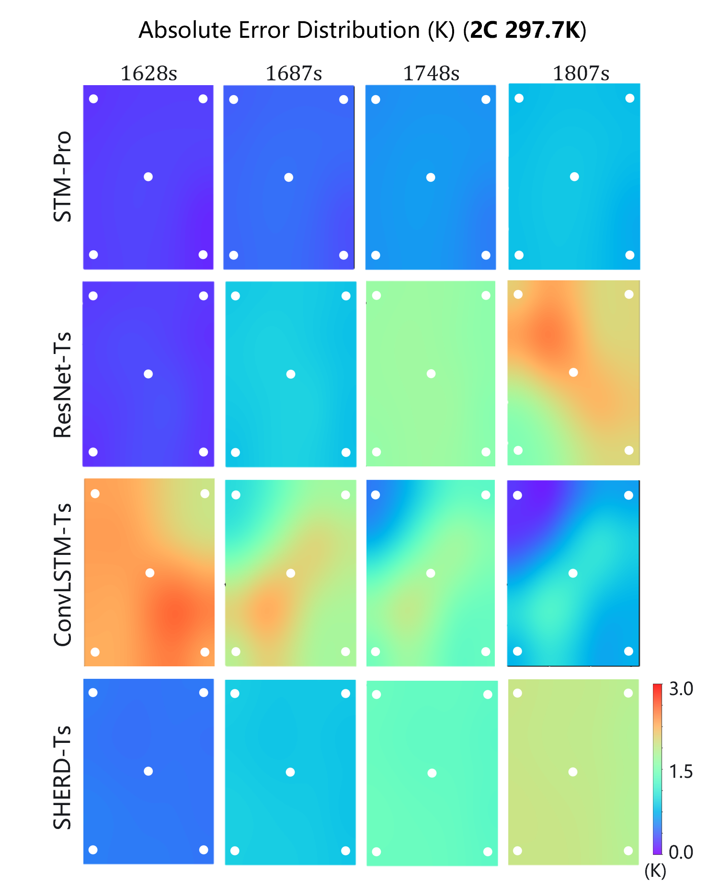

# STM-Pro: Physics-Guided Spatiotemporal Modeling for Battery Temperature​

This repository contains the complete supplementary materials, algorithms, and theoretical derivations for the paper: 
**"Spatiotemporal Modeling and Prediction for Battery Temperature Field Under Sparse Sensing Guided by Physical Priors"**.

## S1. Experimental Datasets (Table S-I)

The model was validated on two types of lithium-ion batteries (LIBs).

| Battery Type | Temp. | Rate | Training Samples | Test Samples |
| :--- | :--- | :--- | :--- | :--- |
| **Pouch-type (LFP)** | 293.7K | 4C | 15,000 | 7,100 |
| **Pouch-type (LFP)** | 297.7K | 2C | 22,425 | 7,500 |
| **Pouch-type (LFP)** | 297.7K | 3C | 33,925 | 11,250 |
| **Pouch-type (LFP)** | 297.7K | 4C | 15,000 | 7,100 |
| **Cylindrical (NCM)** | 288.15K | 4C | 18,000 | 3,600 |

---
## S2. Theoretical Basis of the Neural Differential Operator

The design of the neural differential operator $\mathcal{G}$ is theoretically grounded in the **Galerkin projection** of the heat transfer governing equations.

### S2.1 Temporal Modeling via the Galerkin Method
Using time/space separation, the analytical evolution of the temporal coefficients $\mathbf{a}(t)$ is governed by a system of ordinary differential equations (ODEs):
$$\dot{\mathbf{a}}(t) = -k_1 \cdot \text{diag}(\mathbf{\lambda}) \mathbf{a}(t) + \mathbf{Q}_{\text{proj}}(\mathbf{u}(t))$$
where:
- $\mathbf{\lambda} \in \mathbb{R}^N$: Physical eigenvalues.
- $Q_{\text{proj}} \in \mathbb{R}^N$: Projection of the heat source term $Q(u(t))$ onto the spatial basis functions (BFs) $\{\phi\}_{k=1}^N$.

The projection is defined by the inner product over the spatial domain $\Omega$:
$$Q_{\text{proj}, k}(\mathbf{u}(t)) = \iint_{\Omega} Q(\mathbf{u}(t)) \cdot \phi_{k}(x, y; \lambda_{k}) \, dxdy$$
where $\mathbf{u}(t) = [I(t), V(t)]^T$ (current and voltage) dictates the source intensity.

### S2.2 From Analytical Form to Trainable Architecture
The continuous dynamics are parameterized through a physics-guided neural operator:

1. **Discretized Decay:** Represented as $\bar{k}_1(\bar{\lambda} * z(t))$, where $\bar{\lambda}$ are learnable eigenvalues representing dissipation rates.
2. **Heat Source Projection:** Approximated by module $\mathcal{NN}_{\mathbf{q}}$:

$$\mathcal{NN}_{\mathbf{q}}(u, \bar{\lambda}) = \text{Attn}_{\text{G}}(Q_h, K_h, V_h)$$

$$Q_h = \mathcal{F}_{bf}(\bar{\lambda}), \quad \{K_h, V_h\} = \mathcal{F}_{src}(u)$$

**Multi-Head Galerkin Attention:**
To preserve the physical superposition principle, the softmax function is omitted:

$$\text{Attn}_{\text{G}} = W_o \left[ \text{Concat}_{i=1}^h \left( \frac{Q_i (K_i^\top V_i)}{\sqrt{d_k}} \right) \right]$$

This operation achieves linear computational complexity $\mathcal{O}(N)$. The absence of softmax ensures that the magnitude of the heat source is preserved linearly.

---

## S3. Theoretical Basis of the Trainable Spatial BFs

The construction of BFs is rooted in the analytical Sturm-Liouville solutions for Distributed Parameter Systems (DPSs).

### S3.1 Analytical Sturm-Liouville Solutions
For a battery domain ($x_0$ by $y_0$), the spatial BFs $\varphi(x,y)$ are obtained by:

$$
\begin{aligned}
\varphi_{i}(x) &= \xi_{x, i} \left(\sqrt{\lambda_{x, i}} \cos \left(\sqrt{\lambda_{x, i}} x\right) + h_{k} \sin \left(\sqrt{\lambda_{x, i}} x\right)\right) \\
\varphi_{j}(y) &= \xi_{y, j} \left(\sqrt{\lambda_{y, j}} \cos \left(\sqrt{\lambda_{y, j}} y\right) + h_{k} \sin \left(\sqrt{\lambda_{y, j}} y\right)\right)
\end{aligned}
$$

where $h_k$ is the heat transfer coefficient and $\xi$ are normalization constants.

### S3.2 From Analytical Form to Trainable Architecture
To account for uncertainties in $h_k$ and geometry, STM-Pro transforms these into a trainable form:
- **Learnable Eigenvalues:** Fixed $\sqrt{\lambda}$ are replaced with learnable parameters $\bar{\lambda}$, shared with the temporal operator for spatiotemporal coupling.
- **Learnable Coefficients:** Constants $\xi$ and $\xi \cdot h_k$ are generalized into learnable coefficients $\alpha$ and $\beta$.

This enables the reconstructor to learn optimal spatial representations while remaining constrained by heat transfer physics.

---
### S3.3 Reconstructor & Implementation Details (Table S-III)

Total parameters of reconstructor are kept under **17k** for 2D battery temperature field to ensure spatial reconstruction performance.

| Component | Parameters |
| :--- | :--- |
| **Reconstructor (Spatial BFs)** | 48 |
| **Reconstructor (ResidualConv)** | 16,576 |
| **Total Parameters** | **~16,624** |

---
## S4. Lightweight Time-series Transformer Specifications

To accommodate the strict computational constraints of embedded battery management systems, the time-series transformer $\mathcal{T}$ adopts a lightweight encoder-decoder architecture optimized for efficiency without compromising long-term forecasting accuracy.

### S4.1 Key Architectural Optimizations:

* **Structural Optimization:** Unlike standard transformer implementations (e.g., standard Informer or Transformer), we reduce the FFN (Feed-Forward Network) expansion factor from $4\times$ to $2\times$, aligning the latent dimension $d_{f}$ with the model dimension $d_{model} = N$. The network depth is streamlined to **two encoder layers** and **one decoder layer**.
    
* **Encoder Stage:** The encoder utilizes **ProbSparse Multi-head Attention** to capture long-range dependencies. By evaluating the Kullback-Leibler divergence of attention scores, only the top-$u$ dominant queries ($u = c \ln L$) are selected for dot-product computation, reducing the time complexity from $\mathcal{O}(L^2)$ to $\mathcal{O}(L \ln L)$. A **distilling operation** (1D-Convolution with max-pooling) is applied between layers to halve the sequence length, progressively condensing the feature map.
    
* **Decoder Stage:** The decoder employs a single-layer structure with **masked self-attention** to ensure temporal causality. It interacts with the encoder's compressed feature map via a **cross-attention mechanism** to generate the predicted sequence ${\hat{Y}} \in \mathbb{R}^{L \times N}$ in a generative manner.

> [!NOTE]
> The implementation leverages optimized kernels from the [Time-Series Library (TSlib)](https://github.com/thuml/Time-Series-Library), ensuring seamless integration of these lightweight modifications.
---

### Table S-IV: Hyperparameter Specifications

| Hyperparameter | Value |
| :--- | :--- |
| Input/Output Dimension ($N$) | 64 |
| Model Dimension ($d_{model}$) | 64 |
| FFN Dimension ($d_{f}$) | 128 (2$\times$ Expansion) |
| Attention Heads ($h$) | 4 |
| Encoder Layers | 2 |
| Decoder Layers | 1 |
| ProbSparse Factor ($c$) | 5 |

---
## S5. Spectral-inspired Learning Strategy

### Physical Interpretation
* **Low-frequency modes:** Represent dominant, high-energy global trends (e.g., heat accumulation).
* **High-frequency modes:** Represent localized, low-energy details and rapid variations.

### Freezing Strategy
1. **Ranking:** Eigenvalues are ranked $\bar{\boldsymbol\lambda}_1 > \bar{\boldsymbol\lambda}_2 > \dots > \bar{\boldsymbol\lambda}_N$.
2. **Freezing:** Top-$m$ global modes are frozen after spatial pre-training to anchor the physical structure.
3. **Fine-tuning:** Only high-frequency components adapt during joint training to refine local details without losing global consistency.

## S6. Training Details

### Hardware Specifications
All models were implemented in **PyTorch** and trained on a server equipped with **four NVIDIA GeForce L40 GPUs**.

### S6.1 Training Algorithm & Optimizers
1.  **Pre-training Phase:**
    - **Optimizer:** AdamW.
    - **Learning Rate (LR):** Initial LR of $10^{-2}$, decayed by a factor of 0.1 whenever the training loss decreases by one order of magnitude.
2.  **Training Phase:**
    - Initial epochs use **AdamW** (LR: $10^{-2}$).
    - Switch to **LBFGS** (second-order precision optimizer) for fine-grained convergence.
3.  **Initialization:**
    - **Weights:** Glorot uniform strategy (Xavier initialization).
    - **Biases:** Initialized to zero.

### Multi-Task Loss Weighting
To balance multiple loss terms, STM-Pro utilizes an **adaptive weighting strategy**.
> [!TIP]
> This strategy is implemented using the [LibMTL](https://github.com/median-research-group/LibMTL) framework.

### S6.2 Hyperparameter Tuning
- **Method:** Tree-structured Parzen Estimator (TPE) Bayesian algorithm.
- **Constraints:** Tuning follows the prior condition $N = n^2$ for 2D spatial eigenvalues.
- **Initialization:** Physics-guided parameters (e.g., $\bar{k}_{1}, \theta_{bf}$) are set based on specific battery data sheets.

---

# STM-Pro: Experimental Results & Visualization

## S7. Extended Visualization of Experimental Results

STM-Pro significantly outperforms state-of-the-art (SOTA) methods under various operating conditions. For instance, under a standard $4C$ discharge rate at $293.7$ K, STM-Pro reduces the PMSE by over **50%** compared to the best baseline, achieving an overall accuracy improvement of **72.13%**.

### S7.1 Performance on Pouch-type LIBs

#### Long-term Error Evolution
As the forecasting horizon extends, STM-Pro maintains highly accurate and stable spatiotemporal predictions.

  

*Fig. S-1: Absolute error evolution of STM-Pro and SOTA methods for pouch-type LIBs temperature long-term prediction.*

  

*Fig. S-2: Time-averaged absolute error distribution (Spatial Smoothness comparison).*

#### Generalization Across Discharge Rates (at 297.7 K)
To assess robustness, experiments were conducted across $2C$, $3C$, and $4C$ discharge rates.

**4C Discharge Rate (High Intensity):**
Rapid internal heat generation causes dramatic temperature rises. STM-Pro captures these fast thermal transients where baselines diverge.

  

*Fig. S-3: Temperature prediction and error distribution under 4C discharge at 297.7K.*

**3C & 2C Discharge Rates (Long Duration):**
Extended operation times (up to 1807s for 2C) challenge recursive prediction. SOTA methods like ConvLSTM-Ts often yield "static" predictions, while STM-Pro tracks subtle variations accurately.

  

  

*Fig. S-4: Results under 3C discharge.*

  

  

*Fig. S-5: Results under 2C discharge.*

---

### S7.2 Performance on Cylindrical NCM LIBs

STM-Pro accurately describes the one-dimensional spatial distribution of cylindrical NCM LIB temperature. The trainable spatial BFs demonstrate the characteristics of **one-dimensional parabolic functions**, ensuring spatial smoothness and lower time-averaged error.

  

*Fig. S-6: Absolute error distribution for cylindrical NCM LIBs under 2C discharge.*
